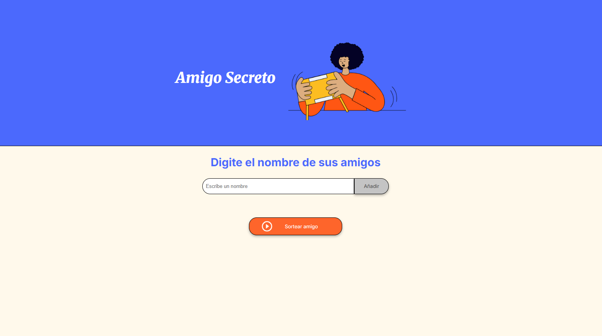

<h1>Juego del Amigo Secreto</h1>

  

<h2>Descripción</h2>

Este proyecto es un <b>juego del amigo secreto</b> en el que los participantes ingresan sus nombres 
y el sistema realiza un sorteo automático para asignar su amigo secreto.  

<h2>Características</h2>
<ul>
  <li>Registro de participantes.</li>
  <li>Sorteo automático y completamente aleatorio.</li>
  <li>Evita repeticiones y asignaciones inválidas.</li>
  <li>Resultados mostrados de forma clara e inmediata.</li>
  <li>Interfaz sencilla y fácil de usar.</li>
</ul>

<h2>Tecnologías utilizadas </h2>
<ul>
  <li> HTML5 → estructura y base de la aplicación. </li>
  <li> CSS3 → estilos visuales y diseño atractivo. </li>
  <li> JavaScript → lógica que gestiona la lista y el sorteo aleatorio. </li>
</ul>

<h2>🚀 Uso</h2>
<ol>
  <li>Clonar este repositorio:
    <pre><code>git clone https://github.com/marianelz/app-amigo-secreto.git</code></pre>
  </li>
  <li>Abrir el archivo <code>index.html</code> en el navegador.</li>
  <li>Ingresar los nombres de los participantes en el formulario.</li>
  <li>Ejecutar el sorteo.</li>
  <li>Cada persona podrá ver a quién le tocó como amigo secreto.</li>
</ol>

<h2>Contribución</h2>

Las contribuciones son bienvenidas. Puedes:

<ul>
  <li>Proponer nuevas funcionalidades.</li>
  <li>Reportar errores en la sección de Issues.</li>
  <li>Hacer pull requests con mejoras.</li>
</ul>
<h2>Licencia</h2>

Este proyecto está bajo la Licencia MIT.

Como práctica de lógica de programación del programa <em>Principiante en Programación G9</em> del Programa ONE de Alura Latam.

<h2>Contacto</h2>

Linkedin: www.linkedin.com/in/marianela-choquepuma

